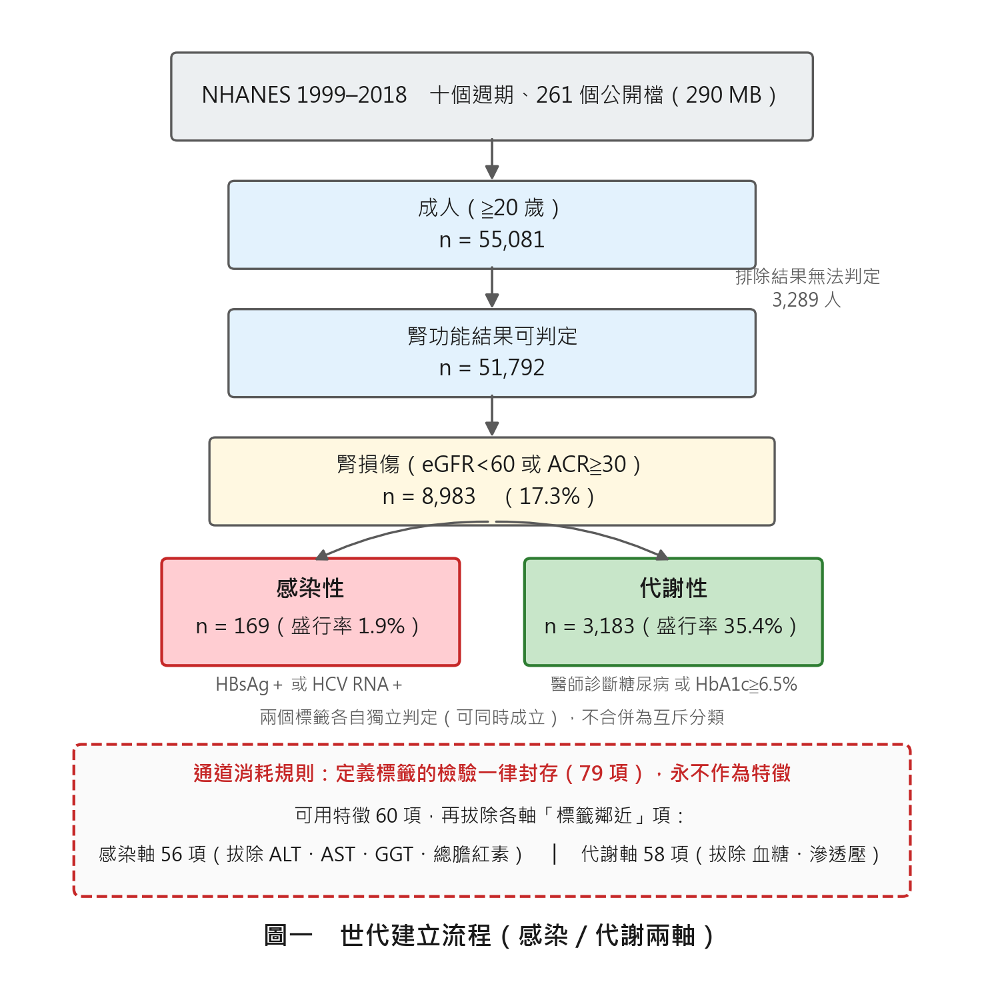
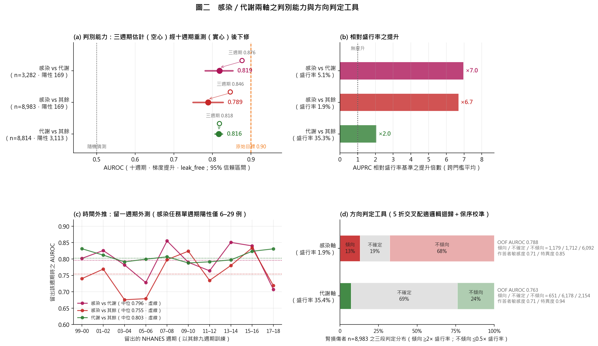
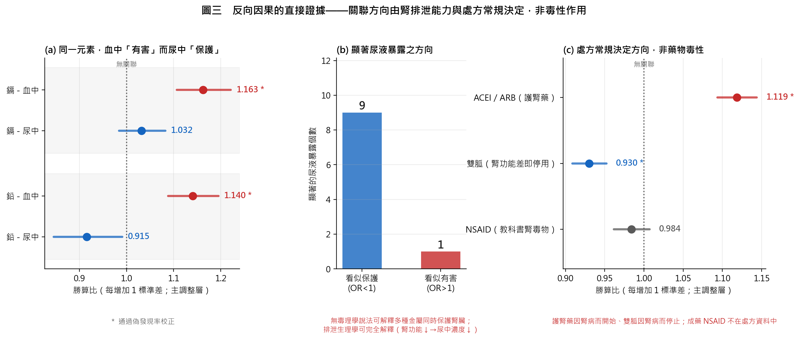
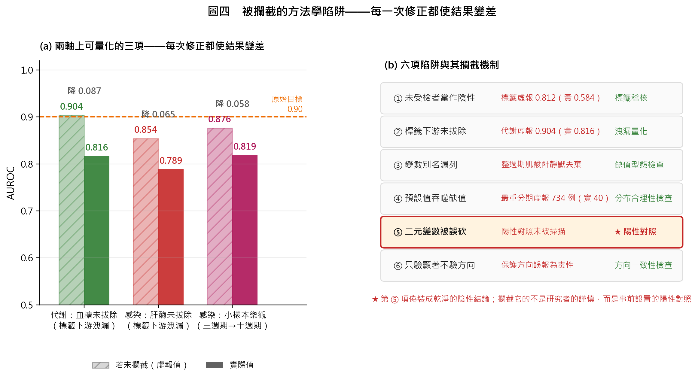

# 血液會說話嗎？

## ——以 55,081 筆真實健康調查資料，檢驗常規血液檢驗回推腎臟病病因的極限

**科別**：生物及醫學（動物與醫學組）　　**組別**：⚠️ 待確認　　**類別**：研究計畫書

> ⚠️ 組別請依實際參賽身分填寫。中華民國中小學科學展覽會設國小、國中、高級中等學校三組；
> 若非參加該賽事（如旺宏科學獎、國際科展、大專組競賽），格式規範不同，須另行調整。

---

## 摘要

腎臟病的病因診斷目前仰賴腎臟切片，具侵入性且無法普及。本研究提出一個可被檢驗的問題：**在開立任何專項檢驗之前，一般健康檢查已有的常規血液與尿液數值，能提供多少病因資訊？**

本研究使用美國國家健康與營養調查（NHANES）1999–2018 年共十個週期、261 個公開資料檔，建立 55,081 名成人之世代，其中腎損傷者 8,983 人。以感染性、免疫性、代謝性三大病因為標的，設計三層防自欺機制（通道消耗規則、陽性／陰性對照、洩漏量化），逐步檢驗「常規檢驗含有病因訊號」此一核心假設。

前期結果顯示：**感染性病因可判別**（AUROC 0.819，95% CI 0.783–0.855）、**代謝性中等**（0.816）、**免疫性近乎隨機**（0.575）。進一步以單標記掃描解剖免疫類的失敗原因，發現 60 個標記中僅「性別」通過偽發現率校正（q=0.004），證實**該類別在此資料中無生理訊號**，而非模型能力不足。

本研究另設計暴露組關聯掃描（ExWAS），於 213 個上游暴露中找出 24 個統計顯著項，但透過兩組內建對照證實其全數無法支持因果解讀：同一元素在血中呈有害方向（血鉛 OR 1.140）而尿中呈保護方向（0.915），符合腎排泄能力下降之生理，而非毒性作用。

**本研究的主要貢獻不在於提出高準確度的預測模型，而在於以嚴謹的對照設計，界定出此類研究的可靠邊界，並記錄六項足以產生假陽性結論的方法學陷阱。** 最終交付物為一個**專注於感染性與代謝性兩軸**的方向判定工具：輸入常規檢驗數值，輸出各軸「傾向／不確定／不傾向」三段判定，並列出推動該判定的檢驗項目。免疫軸因無可學習之訊號而明確排除，待具備補體與自體抗體檢驗之醫院世代再行建立。

**關鍵詞**：慢性腎臟病、病因判別、機器學習、偽發現率、反向因果

---

## 壹、研究動機

>  ⚠️ **待填寫**：此處請補上研究者本人的真實動機（例如接觸到的個案、課堂或新聞所見）。
>  以下為事實性鋪陳，可保留作為第二段。

慢性腎臟病在臺灣的盛行率居全球前列，而確定其**病因**目前主要仰賴腎臟切片。切片需住院、具出血風險，且並非每位病人都適合施行。

由此產生一個疑問：**多數人每年健康檢查都在抽血，那些已經存在的數值裡，難道沒有任何關於病因的線索嗎？**

查閱文獻後發現，腎臟病的三大類病因——感染性、免疫性、代謝性——在教科書上各自有典型的血液表現。既然如此，若把這些數值全部交給電腦分析，是否能在切片之前先縮小範圍？

然而進一步思考後，出現第二個疑問：**如果這件事這麼直覺，為什麼臨床上沒有人這樣做？** 是因為沒有人試過，還是因為試過而做不到？

本研究即為回答此二問題而設計。研究者事先設定：**若假設不成立，將如實報告失敗原因，而非調整方法直到得出好看的數字。**

---

## 貳、研究目的

一、建立可完全重現、且能證明未使用虛構資料的真實世代分析管線。

二、檢驗核心假設：**常規血液與尿液檢驗數值中，是否含有可辨識三大類腎臟病病因的訊號。**

三、若假設部分不成立，解剖其失敗原因，判定係「資料限制」或「方法限制」。

四、設計並驗證一組可推廣的防自欺機制，供後續同類研究使用。

五、依前四項之結果，**只保留有訊號的病因軸**，建立一個可實際操作的方向判定工具：輸入數值、輸出方向與依據。

---

## 參、研究設備及器材

### 一、資料來源

| 項目 | 內容 |
|---|---|
| 資料庫 | 美國國家健康與營養調查（NHANES）|
| 年份 | 1999–2018 年，共 10 個週期 |
| 檔案數 | 261 個公開檔（290 MB）|
| 取得方式 | 美國疾病管制與預防中心（CDC）公開網站，無須申請 |

### 二、軟硬體

| 項目 | 內容 |
|---|---|
| 程式語言 | Python 3.14.3 |
| 主要套件 | pandas 3.0.1、numpy 2.4.3、scikit-learn 1.8.0、scipy 1.17.1 |
| 電腦 | 個人電腦（Windows 11，16 GB 記憶體）|
| 繪圖 | matplotlib（圖表數值全部由結果檔讀取，未手動填寫）|

### 三、真實性保證機制

為確保「不使用任何自製或虛擬資料」，本研究自行設計**出處帳本（provenance ledger）**：

1. 每個下載檔案記錄其**來源網址**與 **SHA256 雜湊值**
2. 分析管線啟動時執行 `require_real()` 函式，逐檔比對雜湊
3. **任何未登錄於帳本、或雜湊不符的檔案，程式直接拒絕執行**

此機制使「資料是真的」成為程式層級的保證，而非口頭聲明。

---

## 肆、研究過程與方法

### 一、世代建立



**圖一　世代建立流程**


#### （一）納入條件

年齡 ≥ 20 歲之成人，共 55,081 人。

#### （二）腎損傷定義（依 KDIGO 2012 國際指引）

```
腎損傷 = 估計腎絲球過濾率 eGFR < 60 mL/min/1.73m²
         或
         尿白蛋白/肌酸酐比 ACR ≥ 30 mg/g
```

其中 eGFR 採用 **CKD-EPI 2021 公式（無種族係數）**。符合者 8,983 人。

#### （三）病因標籤（共病代理）

| 病因 | 判定依據 | 人數 |
|---|---|---|
| 感染性 | B 型肝炎表面抗原陽性 **或** C 型肝炎 RNA 陽性 | 169 |
| 代謝性 | 醫師診斷糖尿病 **或** 糖化血色素 ≥ 6.5% | 3,183 |
| 免疫性 | 抗核抗體陽性 **或** 特異自體抗體陽性 | 107（僅 1999–2004）|

### 二、防自欺機制（本研究之核心設計）

#### （一）通道消耗規則

**凡用於定義標籤的檢驗，一律封存，永不作為特徵。**

例如：糖化血色素定義了代謝性標籤，故它不得用來預測代謝性——否則等同於「用答案預測答案」。本研究共封存 **79 個變數**。

#### （二）標籤鄰近特徵拔除

比封存更進一步。有些檢驗雖未定義標籤，但在**生理上是標籤的直接下游**：

| 病因 | 拔除項目 | 理由 |
|---|---|---|
| 代謝性 | 血糖、滲透壓 | 為糖化血色素的直接生理下游 |
| 感染性 | ALT、AST、GGT、總膽紅素 | 為肝炎的直接生理下游 |

#### （三）洩漏量化

同時執行「拔除前」與「拔除後」兩種特徵集，**兩者差值即為洩漏量**，作為量化證據報告（見表二）。

### 三、模型與評估

#### （一）模型（超參數於見到任何結果之前固定，全程未調）

```python
邏輯迴歸  LogisticRegression(class_weight="balanced", max_iter=4000)
梯度提升  HistGradientBoostingClassifier(max_depth=3, learning_rate=0.08,
                                        max_iter=300, l2_regularization=1.0)
```

僅使用兩個模型：一個線性、一個非線性，足以回答「訊號是否需要非線性才能捕捉」。

#### （二）評估協定

| 項目 | 設定 | 理由 |
|---|---|---|
| 外層 | 5×5 重複分層交叉驗證 | 僅評估，不做任何選擇 |
| 內層 | 5 折，**僅於訓練折上**選定決策門檻 | 門檻若於外層選定，等同使用測試資料做決定 |
| 信賴區間 | 病人層自助重抽 1,000 次 | 觀測單位是「人」而非「折」 |
| 缺值處理 | 中位數插補，於折內配適 | 避免使用全資料統計量 |

#### （三）主要指標

因感染類盛行率僅 1.9%，**以精確度—召回曲線下面積（AUPRC）及其相對盛行率基準之提升倍數為主指標**，AUROC 為輔。

> 說明：盛行率 2% 時，全部猜陰性即有 98% 正確率，故「正確率」在此無意義。

### 四、上游暴露掃描（ExWAS）

為檢驗「病因是否來自外部暴露」，另建立第二套分析：

#### （一）族群設計之修正

先前分析皆**先篩出腎損傷者再問病因**，此為**對結果條件化**，會製造不存在的關聯。本階段改用**全體成人**，腎損傷為結果變項。

#### （二）暴露通道（213 個變數）

處方藥物 13 類、尿液化學品 135、尿中金屬 32、尿砷 14、PFAS 12、血中金屬 4、陰性對照藥 3。

#### （三）五層調整

```
M0 無調整 → M1 ＋年齡性別種族 → M2 ＋體位抽菸
        → M3 ＋糖尿病高血壓 → M4 ＋總用藥數（僅藥物）
```

關聯於哪一層消失，本身即為有用資訊。

#### （四）三組對照設計

| 對照 | 內容 | 判讀 |
|---|---|---|
| **陽性對照** | 已知腎毒性藥（NSAIDs、鋰鹽、PPI、胺基醣苷、鈣調磷酸酶抑制劑）| 掃不出 → 方法無偵測力，其餘結果不可信 |
| **陰性對照** | 無腎機轉藥（外用皮膚藥、眼藥水、鼻噴劑）| 若顯著 → 訊號來自就醫行為，全部降級 |
| **內建對照** | 砷貝他因（海鮮來源之**無毒**砷形式）| 若與毒性砷同時顯著 → 係飲食混淆 |

### 五、方向判定工具（最終交付物）

依伍之一至三的結果，**免疫軸無可學習之訊號**（詳伍之三），故最終工具僅建立感染與代謝兩軸。

#### （一）架構

```
輸入  常規檢驗數值（JSON，缺項以訓練集中位數補入並標明）
        │
        ├─ 感染軸 ── 56 項特徵（拔除 ALT／AST／GGT／膽紅素）
        │            5 折交叉配適邏輯迴歸集成 → 保序回歸校準
        │
        └─ 代謝軸 ── 58 項特徵（拔除血糖／滲透壓）
                     同上
        │
輸出  每軸：校準機率、相對盛行率倍數、三段判定、前四項推動因子
```

#### （二）判定門檻（事前指定，以盛行率倍數定義，不依結果調整）

| 判定 | 條件 |
|---|---|
| 傾向 | 校準機率 ≧ 2 × 該軸盛行率 |
| 不傾向 | 校準機率 ≦ 0.5 × 該軸盛行率 |
| 不確定 | 介於兩者之間 |

以倍數而非固定機率定義，係因兩軸盛行率相差近 20 倍（感染 1.9%、代謝 35.4%），固定門檻對其中一軸必然失效。

#### （三）為何選邏輯迴歸

非因其分數較高，而是伍之一已證明梯度提升在感染軸的優勢（小樣本 +0.081）於樣本擴充後歸零（−0.002），屬過擬合。同分時取係數可讀、參數可攜出者。

---

## 伍、前期研究結果

### 一、核心假設的檢驗



**圖二　三大病因之判別能力**——左為 AUROC 與 95% 信賴區間，右為 AUPRC 相對盛行率基準之提升倍數。免疫類僅 ×1.3。


**表一：三大病因之判別能力（拔除標籤鄰近特徵後）**

| 病因 | 樣本數（陽性）| AUROC [95% CI] | AUPRC 提升倍數 | 判定 |
|---|---|---|---|---|
| 感染性 vs 代謝性 | 3,282（169）| **0.819** [0.783, 0.855] | ×7.0 | ✅ 成立 |
| 感染性 vs 其餘 | 8,983（169）| **0.789** [0.750, 0.828] | ×6.7 | ✅ 成立 |
| 代謝性 vs 其餘 | 8,814（3,113）| **0.816** [0.807, 0.826] | ×2.0 | ⚠️ 成立但增益低 |
| **免疫性 vs 非免疫** | 554（107）| **0.575** [0.518, 0.637] | **×1.3** | ❌ **不成立** |

> 免疫類之提升倍數僅 ×1.3，與隨機猜測（×1.0）幾無差異。

### 二、洩漏量化

**表二：標籤鄰近特徵造成的虛假提升**

| 病因 | 拔除前 | 拔除後 | 洩漏量 |
|---|---|---|---|
| 代謝性 | 0.904 | 0.816 | **+0.088** |
| 感染性 | 0.854 | 0.789 | **+0.065** |

> 代謝性若不拔除血糖即達 0.904，**恰好跨過 0.90 門檻**。此即不得報告「拔除前」數字之原因。

### 三、免疫類失敗原因之解剖

對免疫標籤逐一掃描 60 個檢驗標記，以 Benjamini-Hochberg 法控制偽發現率：

**表三：三大病因之單標記掃描對比**

| 病因 | 掃描標記數 | 通過 FDR<0.05 者 | 最強標記 |
|---|---|---|---|
| 代謝性 | 58 | **28**（48.3%）| 三酸甘油酯（q=1.7×10⁻³³）|
| 感染性 | 54 | **13**（24.1%）| 球蛋白（q=2.9×10⁻⁵，單變量 AUC 0.740）|
| **免疫性** | 60 | **1**（1.7%）| **性別**（q=0.004）← 屬人口學變項，非生理標記 |

**判定：免疫類的失敗不是模型能力不足，是資料中根本沒有可學習的生理訊號。**

進一步查證發現，免疫性腎炎最具判別力的檢驗——**補體 C3／C4、免疫球蛋白、血沉**——**在全部 261 個 NHANES 檔案中完全不存在**。

### 四、上游暴露掃描結果



**圖三　反向因果的直接證據**——同一元素在血中呈有害方向、尿中呈保護方向；顯著的尿液暴露 10 個中 9 個呈保護方向。


213 個暴露中，24 個通過偽發現率校正且存活完整調整。然而透過對照設計，證實其全數無法支持因果解讀：

**表四：兩組內建證據證明反向因果**

| 證據 | 觀察 | 判讀 |
|---|---|---|
| **同一元素，血尿方向相反** | 血鉛 OR **1.140**（有害）／尿鉛 OR **0.915**（保護）| 符合「腎排泄下降→血中升高、尿中降低」之生理，非毒性作用 |
| **處方藥的兩面照妖鏡** | ACEI/ARB OR **1.119**（此為**護腎藥**）／雙胍 OR **0.930**（腎功能差即須停用）| 一因腎病而開始、一因腎病而停止，完全符合處方常規 |

此外，10 個顯著的尿液暴露中有 **9 個呈保護方向**——無任何毒理學說法可解釋九種金屬同時保護腎臟，但排泄生理學可完全解釋。

### 五、方向判定工具之效能

**表六：兩軸方向判定工具（5 折交叉配適，n=8,983）**

| 軸 | 陽性數 | OOF AUROC | 傾向／不確定／不傾向 | 作答者敏感度 | 作答者特異度 |
|---|---|---|---|---|---|
| 感染 | 169 | **0.788** | 1,179／1,712／6,092 | 0.71 | 0.85 |
| 代謝 | 3,183 | **0.763** | 651／6,178／2,154 | 0.71 | 0.94 |

代謝軸「不確定」占 69%——其盛行率 35% 使「2 倍」門檻（≧ 70%）難以達到。此為門檻定義之結果而非模型缺陷；報告時並列拒答率與作答者正確率，不單報後者。

**鎖定保留集示範**（6 名真實病人）：就其已知標籤計 8 個軸判定，5 個方向正確、3 個「不確定」、0 個錯誤。以下為其中一名 B／C 肝陽性者的實際輸出：

```
感染方向  ██████████  0.0762（盛行率 ×4.0）→ 傾向
      →推向 淋巴球 %=39.3   →推向 總蛋白=8.5
      ←推離 嗜中性球 %=48.8  →推向 滲透壓=277
代謝方向  █░░░░░░░░░  0.0725（盛行率 ×0.2）→ 不傾向
      ←推離 AST=190   →推向 ALT=138   ←推離 總膽固醇=235
```

> 工具**不輸出疾病名稱、不輸出免疫方向、不給建議**。它是排序器，不是診斷器。

---

## 陸、討論

### 一、為何免疫類無法判別？三層原因

#### （一）機轉層：三種免疫疾病的腎損傷機制不同，訊號互相抵消

| 疾病 | 腎損傷機制 | 血中表現 |
|---|---|---|
| 全身性紅斑狼瘡 | 免疫複合體沉積 | 補體 C3／C4 **下降** |
| 類風濕性關節炎 | 續發澱粉樣變性、藥物毒性 | 發炎指標**上升**（C3 為急性期蛋白，反而升高）|
| 全身性硬化症 | 血管內皮傷害 | 微血管病性溶血 |

**同一個 C3 在狼瘡下降、在類風濕上升。** 將三者合併為單一「免疫」標籤，最具資訊量的指標被自身抵消。

#### （二）標籤層：抗核抗體陽性 ≠ 自體免疫疾病

一般族群抗核抗體陽性率約一成，其中絕大多數並無任何自體免疫疾病。

#### （三）資料層：關鍵檢驗整批缺席（見伍之三）

### 二、三個病因類別不在同一層級——研究設計之根本檢討

| 類別 | 實際性質 | 「陽性」的意義 |
|---|---|---|
| 感染性 | **病原學診斷** | 病毒確實存在於體內 |
| 代謝性 | **疾病診斷** | 疾病確實存在，但與腎病之關係為共病 |
| 免疫性 | **血清標記** | 一成多的一般人皆為陽性 |

將此三者置於同一分類問題中，要求模型以同一框架處理，本身即為結構性問題。**此為本研究最重要的自我檢討。**

### 三、六項方法學陷阱之記錄

研究過程中，六項足以產生假陽性結論的缺陷被自身設計的檢查所攔截：



**圖四　六項被攔截的方法學陷阱**——左為三項可量化者（每次修正皆使結果變差），右為六項全覽及其攔截機制。

**表五：被攔截的方法學陷阱**

| # | 缺陷 | 若未攔截的後果 | 攔截機制 |
|---|---|---|---|
| 1 | 未受檢者被當作免疫陰性 | 免疫 AUROC 虛報 0.812（實為 0.584）| 標籤稽核 |
| 2 | 血糖未拔除（標籤下游）| 代謝虛報 0.913（實為 0.816）| 洩漏量化 |
| 3 | 變數別名漏列 | 整個 2001–02 週期肌酸酐被靜默丟棄 | 缺值型態檢查 |
| 4 | 程式預設值吞噬缺值 | 最嚴重腎功能分期虛報 734 例（實為 40）| 分布合理性檢查 |
| 5 | 二元變數被誤判為退化欄 | **陽性對照未被掃描，卻回報「方法無偵測力」** | **陽性對照** |
| 6 | 對照判讀只檢查顯著性未檢查方向 | 保護方向被誤報為「支持毒性效應」| 方向一致性檢查 |

> **第 5 項最具啟發性。** 該缺陷偽裝成一個乾淨的陰性結論，若逕行報告，將把程式錯誤包裝為方法學發現。攔截它的並非研究者的謹慎，而是**事前設置的陽性對照**。
>
> 由此修正了對陽性對照用途的理解：**它不僅驗證方法是否有效，更驗證「以為在執行的程序是否真的在執行」。**

### 四、研究限制

一、標籤為**共病代理**而非腎臟切片確診，此為本研究之天花板。

二、橫斷面設計無時序資訊，**原則上**無法建立因果方向。

三、化學品檢驗僅於三分之一子樣本執行，偵測力低於藥物通道。

四、未使用調查權重（研究目的為判別而非盛行率推估）。

---

## 柒、結論

一、**核心假設部分成立。** 常規血液檢驗對**感染性**腎損傷具中等判別力（AUROC 0.789–0.819，AUPRC 提升 ×6.7–7.0），對**免疫性**則近乎無判別力（×1.3）。

二、**免疫類的失敗屬資料限制而非方法限制。** 60 個標記中僅「性別」通過偽發現率校正，且該類別最具判別力之檢驗（補體 C3／C4、免疫球蛋白、血沉）於全部 261 個檔案中不存在。

三、**上游暴露掃描的 24 個顯著結果全數無法支持因果解讀，且其失敗模式為內部一致的。** 同一元素血中升高／尿中降低、護腎藥與禁忌藥呈相反方向，二者皆指向反向因果而非致病作用。

四、**橫斷面資料無法回答病因問題，此為原理性限制。** 四條提升途徑（增加特徵、更換模型、更換隨機種子、擴充樣本）皆經實測無效，其中擴充樣本 3.8 倍反使結果下修 0.057，揭露先前估計含小樣本樂觀偏誤。

五、**最終交付物為專注感染／代謝兩軸之方向判定工具。** 免疫軸經三層解剖（機轉層、標籤層、資料層）確認無可學習訊號後明確排除，而非勉強保留一個近隨機的輸出。工具以事前定義之盛行率倍數門檻輸出三段判定，並附推動因子，可追溯。

六、**本研究之主要貢獻為方法學。** 六項被攔截的陷阱、方向模式作為反向因果的診斷工具、以及「陽性對照驗證的是程序是否真的執行」此一認識，可供任何使用公開資料進行醫學預測之研究參考。

---

## 捌、未來展望

### 一、本研究的位置

本研究為三階段計畫之**第一階段**：以公開資料界定「常規檢驗回推病因」的可靠邊界。
第一階段已完成，結論明確——感染性可判別、代謝性中等、免疫性無訊號，且橫斷面資料原理上無法定因果方向。
第二階段（醫院切片世代）之資料來源已確認可取得，規格書已備；第三階段（縱貫與因果）視第二階段結果決定。

### 二、三階段路線圖

| 階段 | 目標 | 資料 | 成功判準 | 狀態 |
|---|---|---|---|---|
| **一** | 界定可靠邊界、建立防自欺管線 | NHANES 公開資料 n=55,081 | 三軸各得明確結論；六項陷阱記錄 | ✅ 完成 |
| **二** | 以切片診斷驗證，重建免疫軸 | 醫院世代，每類 ≧150 例 | 免疫軸 AUROC ≧0.80；感染／代謝與第一階段一致 | ⏳ 等資料 |
| **三** | 從關聯推進到因果方向 | 縱貫追蹤或基因工具變數 | 至少一個暴露之因果方向獲獨立方法支持 | 視二而定 |

### 三、第二階段：醫院切片世代

#### （一）三個必要條件

| 條件 | 為什麼必要 | 若不滿足 |
|---|---|---|
| **標籤為切片診斷**（受控詞彙兩層）| 第一階段證明代理標籤是天花板 | 退化成另一個 NHANES |
| **檢驗在診斷前 0–90 天** | 第一階段證明橫斷面無法定方向 | 血鉛↑尿鉛↓的假象重演 |
| **含補體 C3／C4、抗 dsDNA、抗 PLA2R、ANCA** | 免疫軸失敗之直接原因即此批檢驗缺席 | 免疫軸仍無法建立 |

完整規格見 [[醫院資料需求規格_v1]]。

#### （二）事前登錄的效能預期（寫在看到資料之前）

| 軸 | 預期 AUROC | 依據 | 若低於預期的解讀 |
|---|---|---|---|
| 免疫 vs 其餘 | **0.80–0.88** | 同型研究具 anti-dsDNA＋補體者達 0.880（Yang 2024）| 標籤品質或時序有問題 |
| 感染 vs 其餘 | 0.80–0.85 | 第一階段 0.789，醫院盛行率較高 | 與公開資料不一致，須查族群差異 |
| 代謝 vs 其餘 | 0.80–0.85 | 第一階段 0.816 | 同上 |
| 免疫細項（狼瘡／膜性／IgA）| 0.75–0.85 | 樣本較少 | 細項樣本不足，僅做描述 |

**明文不設 0.90 為目標。** 文獻最佳同型研究為 0.880，且其族群已限定為 SLE 腎侵犯者。

#### （三）免疫軸重建計畫

第一階段證明「免疫」合併為單一類別時，狼瘡（C3↓）與類風濕（C3↑）的訊號互相抵消。
故第二階段免疫軸**不再是一個二元標籤**，而是依切片細項分別建模：

```
免疫軸
 ├─ 狼瘡腎炎（LN I–VI）   ← C3/C4↓、抗 dsDNA↑
 ├─ 膜性腎病（MN）        ← 抗 PLA2R＋（特異度 0.97）
 ├─ IgA 腎病（IgAN）      ← 血清 IgA↑、Gd-IgA1
 ├─ ANCA 血管炎           ← MPO／PR3 ANCA＋
 └─ 抗 GBM 病             ← 抗 GBM＋（敏感 0.93／特異 0.97）
```

每一細項 ≧50 例始報告個別效能；不足者僅描述。

#### （四）工具面：`direction.py` 的擴充

| 現況（第一階段）| 第二階段 |
|---|---|
| 兩軸：感染、代謝 | 三軸：加回免疫 |
| 免疫軸空白 | 免疫軸輸出細項方向（狼瘡／膜性／IgA…）|
| 標籤為代理 | 標籤為切片診斷，輸出可標「傾向狼瘡腎炎 ×3.2」|
| 門檻依盛行率倍數 | 同，但盛行率改用醫院世代之值 |

管線全部現成（出處帳本、通道消耗規則、巢狀交叉驗證、鎖定保留集、對照設計），
**唯一新增為「檢驗日期早於診斷日期」之硬檢查**。

### 四、第三階段：從關聯到因果

第一階段的 ExWAS 證明橫斷面資料在原理上無法定方向。第三階段依第二階段結果擇一或並行：

| 途徑 | 做法 | 需要 | 已備 |
|---|---|---|---|
| **縱貫追蹤** | 暴露測量在腎損傷發生之前，追蹤至結果 | 多次就診之世代 | 醫院資料若含歷次檢驗即可 |
| **孟德爾隨機化** | 以基因當工具變數 | 暴露之大型 GWAS | MR 核心已建並通過已知答案檢驗；惟金屬 GWAS 過小（n=949），先做尿酸、血壓、糖尿病等大型性狀 |
| **自然實驗** | 政策造成之暴露差異（如汽油除鉛）| 出生世代作為工具 | 尚未探索 |

第三階段之核心問題：**第一階段找到的「關聯」，有哪些在時序與工具變數下仍成立？**

### 五、方法學產出的推廣

第一階段最有價值的產出並非準確率，而是六項被攔截的陷阱。未來擬整理為：

1. **公開資料醫學預測研究之檢核清單**——標籤污染、未來資訊洩漏、變數別名、缺值預設值、假 200 錯誤頁、平均指標高估作業點
2. **陽性對照的擴充定義**——不只驗證方法有效，更驗證「以為在跑的東西真的在跑」
3. **方向模式作為反向因果診斷**——同一元素血中↑尿中↓，可套用於任何暴露研究

### 六、風險與備案

| 風險 | 影響 | 備案 |
|---|---|---|
| IRB 審查延遲 | 第二階段延後 | 先以第一階段成果投稿方法學論文 |
| 醫院資料檢驗不在診斷前 | 時序優勢喪失 | 退而分析「診斷前」子集，不足則僅做描述 |
| 免疫細項樣本 <50 | 細項無法報告效能 | 合併為「免疫 vs 其餘」，細項僅描述 |
| 免疫軸仍未達 0.80 | 假設再次不成立 | 照實報告；解剖原因（標籤／時序／檢驗缺項）|
| 感染／代謝與第一階段不一致 | 類化性存疑 | 比較兩世代盛行率與族群組成，報告差異來源 |

**任一情境皆不調整事前判準。** 第一階段的紀律——未達成即照實報告——延續至第二、三階段。

### 七、時程

| 時間 | 工作 | 產出 |
|---|---|---|
| 第 1–2 月 | IRB 申請；與合作醫師確認萃取規格 | IRB 核准；規格書定稿 |
| 第 3–4 月 | 資料萃取、去識別化、交付前自我檢查 | 三張 CSV |
| 第 5 月 | 資料進管線：出處帳本、時序檢查、標籤驗證 | 世代摘要 |
| 第 6–7 月 | 三軸訓練、免疫細項、鎖定保留集一次評估 | 效能報告 |
| 第 8 月 | 與第一階段對照、撰寫 | 第二階段報告 |
| 第 9 月起 | 依結果決定第三階段路徑 | — |

---

## 玖、參考資料

1. Levey AS, et al. KDIGO 2012 Clinical Practice Guideline for the Evaluation and Management of Chronic Kidney Disease. *Kidney Int Suppl.* 2013.

2. Inker LA, et al. New Creatinine- and Cystatin C-Based Equations to Estimate GFR without Race. *N Engl J Med.* 2021.

3. Benjamini Y, Hochberg Y. Controlling the False Discovery Rate. *J R Stat Soc B.* 1995;57(1):289-300.

4. Yang P, et al. Machine learning models predicts risk of proliferative lupus nephritis. *Front Immunol.* 2024;15:1413569. DOI: 10.3389/fimmu.2024.1413569

5. Dai H, Zhang H, He Y. Diagnostic accuracy of PLA2R autoantibodies and glomerular staining. *Sci Rep.* 2015;5:8803. DOI: 10.1038/srep08803

6. Shiroshita A, et al. Accuracy of Anti-GBM Antibodies in Diagnosing Anti-GBM Disease. *Am J Nephrol.* 2021;52(7):531-538. DOI: 10.1159/000518362

7. Lanktree MB, et al. HDL Cholesterol, LDL Cholesterol, and Triglycerides as Risk Factors for CKD: A Mendelian Randomization Study. *Am J Kidney Dis.* 2018;71(2):166-172. DOI: 10.1053/j.ajkd.2017.06.011

8. Wuttke M, et al. A catalog of genetic loci associated with kidney function. *Nat Genet.* 2019;51:957-972.

9. National Center for Health Statistics. National Health and Nutrition Examination Survey (NHANES) 1999–2018. Centers for Disease Control and Prevention.

---

## 拾、附錄

### 附錄一：資料真實性驗證

全部 261 個檔案之來源網址與 SHA256 雜湊值記錄於 `params/manifest.json`，任何人可依此重新下載並驗證。

### 附錄二：訓練紀錄

本研究全部訓練過程記錄於 `results/runs_log.jsonl`（僅可附加、不可修改），共 **106 筆**，包含每次執行之時間、任務、特徵集、模型、全部評估指標。

### 附錄三：方向判定工具

`kidney_cause/direction.py`：`train` 訓練並存可攜參數（5 折集成係數＋保序校準表，任何語言可重建）、`predict values.json` 對新病人判定、`demo` 以保留集真實病人示範。

### 附錄四：變數清單

完整變數字典見 [`附錄三_變數字典.md`](../kidney_cause/docs/附錄三_變數字典.md)：
檢驗特徵 60 項（含單位、有值人數、覆蓋率、中位數）、上游暴露 213 項、封存變數 79 項（含封存理由），合計 **352 項**。

另附「已確認不存在於 NHANES 之關鍵檢驗」一覽——此表即為免疫類判別失敗之直接原因。
